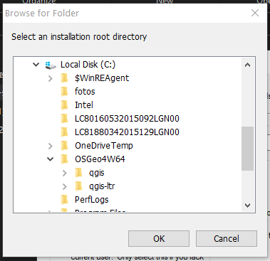
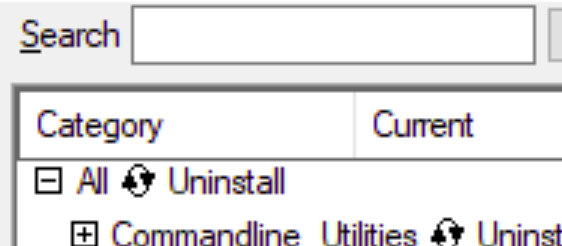

Uninstalling QGIS with OSGeo4W Network Installer
================================================

For a beginner user trying to install QGIS with the the OSGeo4W Network
Installer could be a little overwhelming since it has a lot of packages and
options.

But knowing how to use the OSGeo4W installer grant the user advanced options
for customize your QGIS, adding more libraries and functions.
Installing QGIS with OSGeo4W Network Installer

Requirements
------------

- Windows OS
- Internet connection
- OSGeo4W Network Installer
- Time

Goals
-----

- Uninstalling QGIS, GRASS and SAGA using the OSGeo4W Network Installer

Difficulty
----------

- Easy! :)

Advice
------

Read carefully the indications in the OSGeo4W installer, if not, you may end
with a disaster of packages

Read the `advanced installation tutorial first! <Installing_QGIS_with_OSGeo4W/advanced_installation.rst>`_

Downloads
---------

You can download the OSGeo4W Network Installer form QGIS.org

`QGIS Download <https://www.qgis.org/en/site/forusers/download.html>`_

Make sure to download the OSGeo4W Network Installer according to your CPU
architecture.

.. image:: img/osgeo4w.png
    :width: 15 cm
    :align: center

-------------------------------------------------------------------------------

STEP 1
------

Open the OSGeo4W Network Installer and select *Advanced installation*

.. image:: img/162527.png
    :width: 15 cm
    :align: center

-------------------------------------------------------------------------------

STEP 2
------

Select the root directory, this is really important **Select the directory
that contain the installation you what to remove**

You may see that I select the subfolder containing the specific installation
of QGIS that I want to remove, this is really important because the OSGeo4W
Network Installer is going to recognize the version of the packages in that
folder allowing you to changed or removed

-------------------------------------------------------------------------------

STEP 3
------

Removing or uninstalling all, QGIS, GRASS and SAGA is really easy because we
want to remove all of them, in the list, using the upper element you can cycle
though the arrow until you see the *Uninstall*

Look the image above, see that cycling though the element *All* would change
the whole list!

.. image:: img/162739.png
    :width: 15 cm
    :align: center

Notice that now all the categories in the list at the end say *Uninstall* this
indicate that all packages in all categories are going to be removed

-------------------------------------------------------------------------------

WARNING
-------

Be careful when using the *All* element in the list you could end up installing
all of the packages in the OSGeo4W that is going to cause problems

-------------------------------------------------------------------------------

STEP 4 FINAL
------------

Now just wait until OSGeo4W finish the uninstall

.. image:: img/162842.png
    :width: 15 cm
    :align: center

after this ends, I recommend going and delete the subfolder where the
installation was, just to erase some leftovers!

Now you have uninstalled QGIS, GRASS and SAGA using OSGeo4W Network Installer
=============================================================================
