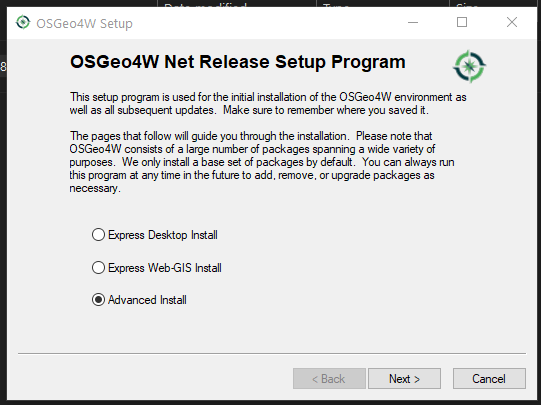
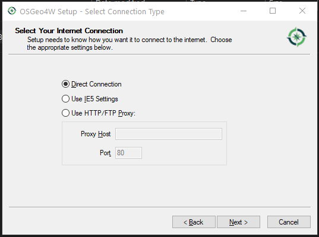
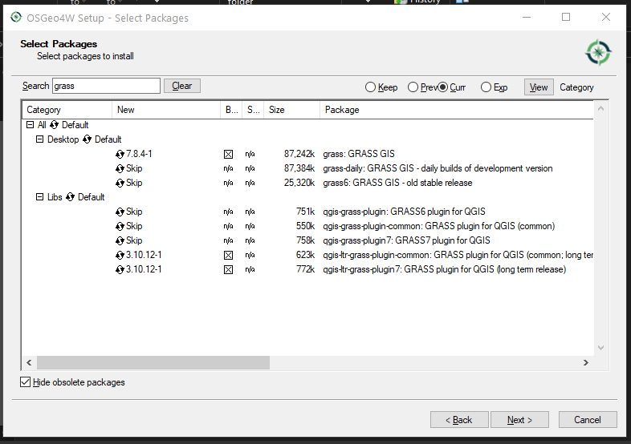
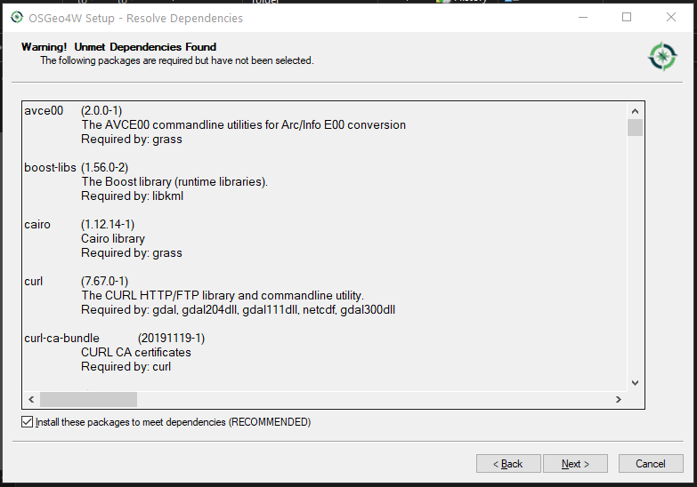
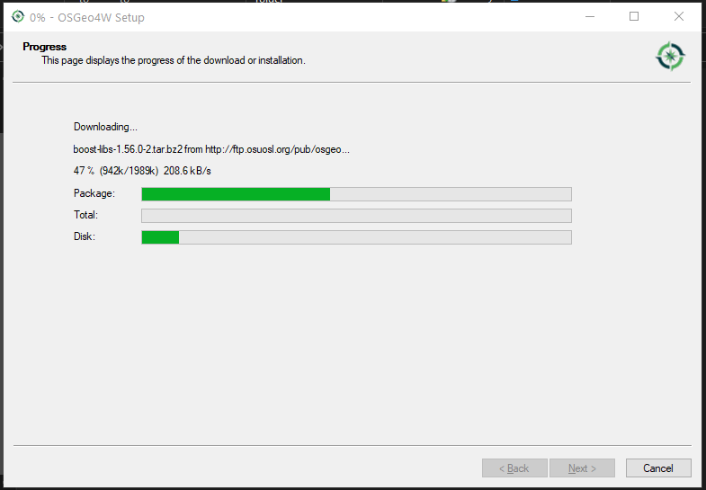

Installing QGIS with OSGeo4W Network Installer
==============================================

For a beginner user trying to install QGIS with the the OSGeo4W Network
Installer could be a little overwhelming since it has a lot of packages and
options.

But knowing how to use the OSGeo4W installer grant the user advanced options
for customize your QGIS, adding more libraries and functions.

Requirements
------------

- Windows OS
- Internet connection
- OSGeo4W Network Installer
- Time

Goals
-----

- Installing QGIS with GRASS and SAGA from OSGeo4W Network Installer

Difficulty
----------

- Easy! :)

Advice
------

Read carefully the indications in the OSGeo4W installer, if not, you may end
with a disaster of packages

Downloads
---------

You can download the OSGeo4W Network Installer form QGIS.org

`QGIS Download <https://www.qgis.org/en/site/forusers/download.html>`_

Make sure to download the OSGeo4W Network Installer according to your CPU
architecture.

.. image:: img/osgeo4w.png
    :width: 15 cm
    :align: center

-------------------------------------------------------------------------------

STEP 1
------

Open the OSGeo4W Network Installer and select "Advanced install"

This would give us the ability to select the packages ourself

-------------------------------------------------------------------------------

STEP 2
------

Then select "Install form the Internet" this is why you need a internet
connection, you can use a directory or download without installing this is
useful if you need to take the packages to another PC.

.. image:: img/162558.png
    :width: 15cm
    :align: center

-------------------------------------------------------------------------------

STEP 3
------

We need to select a root directory, another advantage of using the OSGeo4W
Network Installer, is that you may have different versions of QGIS even with
different libraries

.. image:: img/162613.png
    :width: 15cm
    :align: center

I recommend create a OSGeo4W64 folder in C: in Windows, this way you can have
all the version in one place.

.. image:: img/162634.png
    :width: 15cm
    :align: center

As you may see in the image above, I have a tow folders

- qgis: for the latest release
- qgis: for the long term release

This way I have all my installations in one place, I recommend you do the same

-------------------------------------------------------------------------------

STEP 4
------

The OSGeo4W Network Installer uses a temporary folder to store the libraries

.. image:: img/162652.png
    :width: 15cm
    :align: center

you may live this at it is!

STEP 5
------

Internet connection selection depends on your setup for me "direct connection"
work great.

-------------------------------------------------------------------------------

STEP 6
------

Select a download site, this is very important, my experience its that is
better if you choose a site close to your location!

.. image:: img/162722.png
    :width: 15cm
    :align: center

for this you can try to
estimate (no ideal but is a good approximation) using the ping function form
PowerShell to determinate which site is closer to you!

For me ftp.osuosl.org give a ping result under 80ms

-------------------------------------------------------------------------------

STEP 7
------

Selecting the packages, if you have used some package manager form linux like
apt, pacman, others, you may see that the OSGeo4W Network Installer what really
its trying to bring a package manager to Windows for the OSGeo softwares

Search for QGIS by typing in the search box

.. image:: img/163346.png
    :width: 15cm
    :align: center

You may see a lot of different packages, don't worry! read carefully each
package name to see what it is, in this moment we are looking for QGIS LTS so:

- qgis-lts: QGIS Desktop (Long Term Release)

is the name we need!

but, how selected for install, just click in the circular arrows, you would
cycle through different options, we you select the las version thats when
you selected for installation

.. image:: img/qgis_3.png
    :width: 15cm
    :align: center

You need to know what is the last version, in my case at this time was 3.10.12
when I see that number I know that is selected for install.

-------------------------------------------------------------------------------

STEP 8
------

Installing GRASS, with GRASS is the same thing BUT **we need to make sure to
install the plugin** so the integration with QGIS its good!

Search for GRASS in the search box

Let me break down the image above:

1. In the **Desktop** section of the list Lookup for: GRASS GIS 7
2. Here is GRASS GIS latest version
3. Cycle through number until you see the last version
4. In my case and time 7.8.4 is the latest

QGIS 3.10 is compatible with GRASS 7 so is safe to use this!

*Looking for the plugin*

1. In the **libs** section of the list
2. look for the qgis-lts-plugin7 and for qgis-lts-plugin7-common
3. They would have version numbers matching the version of QGIS

with this 2 libs you are installing the GRASS plugin in QGIS

-------------------------------------------------------------------------------

STEP 9
------

Installing SAGA, know we are going to install SAGA for working within QGIS, it
much more simple than installing GRASS

.. image:: img/163429.png
    :width: 15cm
    :align: center

In the search box type SAGA, you would only be presented with 2 options (at the
moment) select the saga-lts version, cycle in the arrows until you see the
version number, in my case is 2.3.2

-------------------------------------------------------------------------------

WARNING
-------

Make sure you only selected what I show you here, in the list all the other
options HAVE to be in **Skip** if not you may end up installing more software
than you what

-------------------------------------------------------------------------------

STEP 10
-------

Now the OSGeo4W Network Installer its going to resolve all the dependencies for
each package that we select

Make sure you have the check in *Install these packages to meet dependencies*
its RECOMMENDED!

STEP 11
-------

Read the licencees agreement

STEP 12 FINAL
-------------

Install everything!!

Now wait for the download and installation finish

Enjoy your QGIS, GRASS and SAGA!
================================
